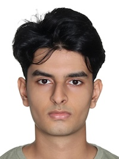
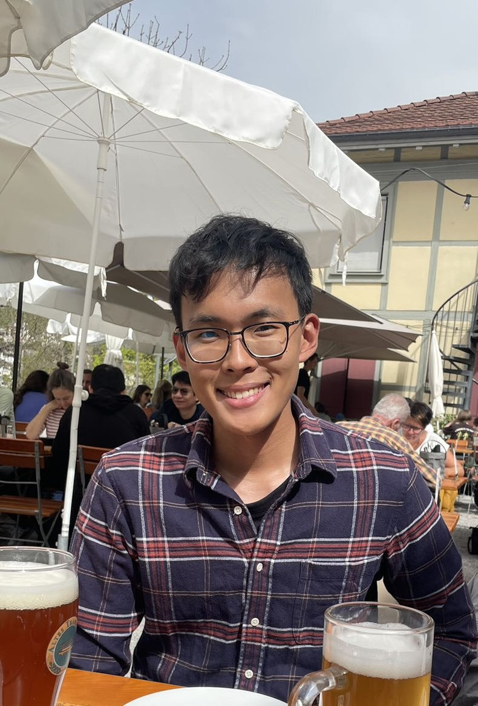

We are a team based in the [School of Computing, National University of Singapore](https://www.comp.nus.edu.sg).

You can reach us at the email `seer[at]comp.nus.edu.sg`

## Project team

### Abhijit Jayaraman

[[github](https://github.com/jit1604)]

* Role: Developer
* Responsibilities: Search feature

### Andre Liu

[[github](http://github.com/AndreLiu1225)]

* Role: Developer
* Responsibilities: Full-Stack Development

### Tauzih Khan

[[github](http://github.com/tauzihkhan)]

* Role: Team Lead
* Responsibilities: Model

### Jean Doe

[[github](http://github.com/johndoe)]
[[portfolio](team/johndoe.md)]

* Role: Developer
* Responsibilities: Dev Ops + Threading

### James Doe

[[github](http://github.com/johndoe)]
[[portfolio](team/johndoe.md)]

* Role: Developer
* Responsibilities: UI
